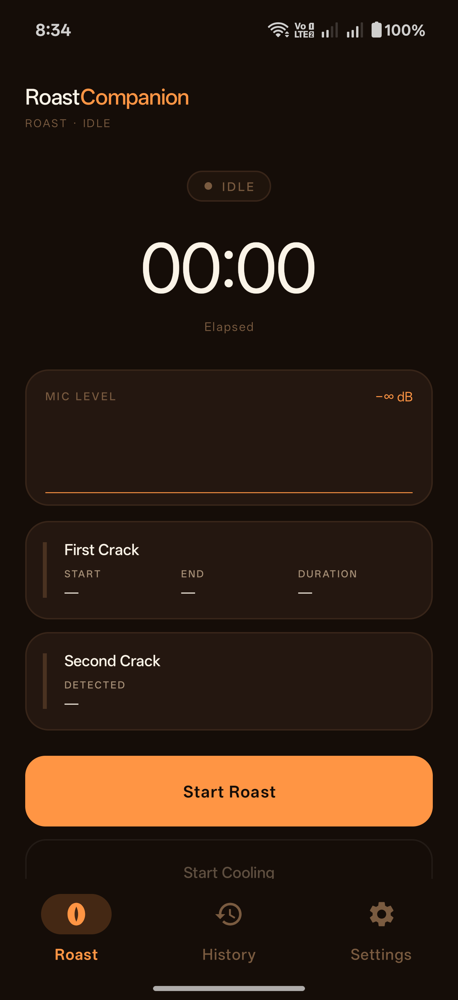
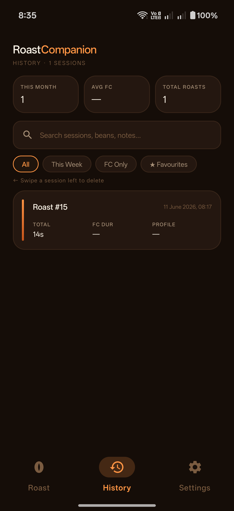
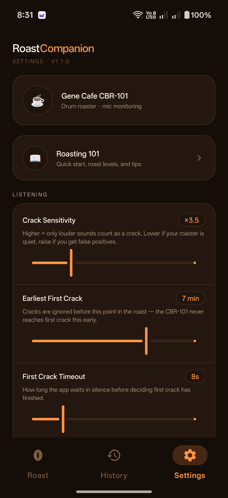
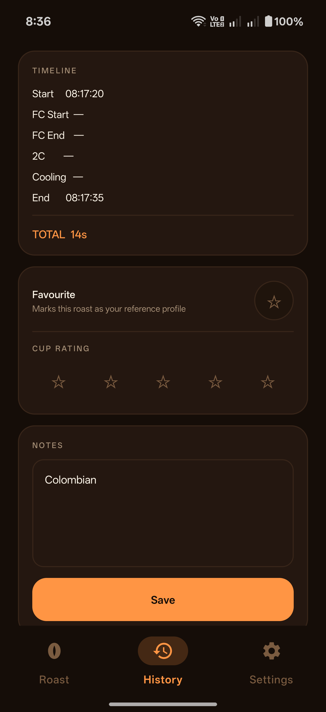

# RoastCompanion

A native Android app for monitoring coffee roasts on the **Gene Cafe CBR-101** drum roaster. It listens through the device microphone and uses real-time audio analysis — amplitude, spectral content, **and a small on-device machine-learning classifier** — to detect first crack and second crack, alarm you at second crack, and track the CBR-101's cooling carryover.

Built for personal use by an experienced home roaster — no onboarding, no fluff.

> **© 2026 Bjorn Technologies. All rights reserved.** Proprietary and
> confidential — see [LICENSE](LICENSE). Any public visibility of this
> repository is for demonstration only and grants no right to use, copy, or
> distribute the software, algorithms, or trained models.

---

## Screenshots

<table>
  <tr>
    <td align="center"><br/><sub>Roast</sub></td>
    <td align="center"><br/><sub>History</sub></td>
    <td align="center"><br/><sub>Settings</sub></td>
    <td align="center"><br/><sub>Session Detail</sub></td>
  </tr>
</table>

---

## Features

### Roast Monitoring
- **Start Roast** begins a session, starts the roast timer, and activates microphone monitoring via a foreground service
- Real-time **mic level meter** (scrolling chart) so you can see the audio environment is being captured
- Running **session timer** displayed prominently throughout, in elapsed roast-time
- **Live roast-level indicator** — a pill that shows where you'd land if you dropped now (City → City+ → Full City → Full City+ → Vienna → French) as development progresses
- Action buttons (Start / Pause / Stop / Reset) are pinned in a fixed footer, always reachable without scrolling

### First & Second Crack Detection
Detection combines five gates — a frame only counts toward a crack when all agree:

1. **Warmup** — the first 3s of a session build the ambient noise floor; nothing detects during warmup
2. **Amplitude** — RMS must exceed the ambient floor × a sensitivity multiplier
3. **Spectrum** — an FFT checks that enough energy sits in the 2–9 kHz band where cracks live (rejects voices, fan, thuds)
4. **ML classifier** — a tiny 3-class TFLite model (ambient / first crack / second crack) decides the crack *type* by sound, not by timing
5. **Time / pattern gates** — first crack is ignored before a configurable earliest time; confirmation needs several transients spread over time (real crack rolls, not a burst of clicks)

- First crack logs **start** and (after a sustained quiet period) **end** + duration
- The roast cards **flood with colour** as progress bars: first crack fills across the FC→SC stretch, second crack fills toward your pull point, paced by your reference roast
- On second crack: a **loud device alarm** + vibration + a themed **alert sheet** with a big "Silence & dismiss" button

### Crack Classifier & Training Pipeline
- The classifier is a ~15 KB TFLite model with 15 features per 50 ms frame (13 MFCCs + log-RMS + 2–9 kHz spectral ratio), shipped in `app/src/main/assets/`
- **Record roasts for training** (Settings → Training, off by default) saves a WAV + a JSON of confirmed crack timestamps per session to the app's external files dir
- Recordings can be shared from session detail and pulled to a workstation; `training_data/scripts/train.py` labels them, trains the 3-class model, and exports the TFLite + normalization params
- The model improves with every recorded roast — see [Audio Detection Algorithm](#audio-detection-algorithm)

### Reference Roast
- Star a roast ★ as a favourite to make it the **reference** — its FC/SC times show as live targets on the Roast screen and set the pacing for the progress bars

### CBR-101 Carryover Cooling
- "Start cooling" (from the second-crack alert) opens a carryover timer — the CBR-101 keeps developing beans for ~45s after you pull, and this counts it down

### Roast Log
- Every session is saved to a local **Room database**
- Log screen lists sessions newest-first with search, filter, and swipe-to-delete (with undo)
- Session detail shows the full timeline in **elapsed roast-time** (Start → FC Start → FC End → 2C → Cooling → End), derived stats (development time, DTR), editable notes, a 1–5 cup rating, temperatures, and bean/weight metadata
- **Autocomplete dropdowns** for roast name, bean, and green weight — pulled from your own past roasts so you don't retype
- CSV export / import (RFC-4180, dedupes on start time) and Delete All History

### Settings
| Setting | Default | Description |
|---|---|---|
| Crack Sensitivity | 3.5× | Spike must exceed N × ambient noise floor |
| Earliest First Crack | 9 min | Cracks ignored before this point — the CBR-101 never reaches FC earlier |
| FC Quiet Period | 25s | Sustained quiet after FC activity before FC is marked complete |
| Min Transients (FC) | 2 | Transients required (spread over time) to confirm first crack |
| Min Transients (SC) | 2 | Transients required to confirm second crack |
| Record roasts for training | Off | Save WAV + label JSON per roast for model training |
| Keep Screen Awake | On | Only while a roast is active |
| Alarm Sound / Vibration | On | Alert on crack events |

---

## Audio Detection Algorithm

The engine runs entirely on-device with no network dependency.

**Capture:** AudioRecord at 44100 Hz, 16-bit PCM mono, read in 50 ms windows (2205 samples) → 20 analysis frames/second.

**Noise floor:** a rolling deque of the last 100 RMS frames (~5s); the ambient estimate uses the **lower 70th percentile**, updated only from non-spike frames so cracking doesn't inflate the baseline.

**Per-frame gates (all must pass):**
- **Amplitude** — `RMS > ambient × sensitivity`. Second crack is quieter than first, so a lower amplitude bar (1.8×) is used once the app is listening for SC.
- **Spectral** — a 2048-pt FFT; ≥12% of audible energy must fall in 2–9 kHz (cracks are high-frequency pops; motor/fan/thuds score near zero).
- **ML classifier** — the surviving frame is run through the 3-class TFLite model; its argmax decides ambient / FC / SC. Because the model judges *type by sound*, a continuing first-crack roll is classified FC and can't be mistaken for second crack.

**Time & pattern gates:**
- First crack is ignored before **Earliest First Crack** (default 9 min).
- FC confirmation needs several transients **spread over ≥4s** within a 15s window — a real crack rolls; a burst of clicks doesn't qualify.
- Second crack can't be declared within **75s** of first crack (a hard floor against the FC-roll-misread-as-SC cascade).

**State machine:**
```
IDLE → [Start] → MONITORING
MONITORING → [FC-class transients, after earliest-FC time] → FIRST_CRACK_ACTIVE
FIRST_CRACK_ACTIVE → [quiet period elapsed] → FIRST_CRACK_COMPLETE
FIRST_CRACK_COMPLETE → [SC-class transients, ≥75s after FC] → SECOND_CRACK_ACTIVE
SECOND_CRACK_ACTIVE → [Start cooling] → COOLING
```

**Training:** the model is trained from real recorded roasts (`training_data/scripts/train.py`). Labels come only from human-verified crack times; the trainer extracts MFCC + RMS + spectral features per frame, class-weights the heavily imbalanced data (ambient ≫ FC ≫ SC), and exports a float TFLite model plus a `feature_norm.json` of per-feature mean/std. The recorded alarm tone is automatically blanked out of the labels so the model never learns its own alarm as a crack.

---

## Usage Tips

- **Phone placement:** the **exhaust side** of the CBR-101 gives the best read — the vent channels crack sound and sits away from the bulk fan roar. Keep the same placement every roast so the model's learned thresholds transfer.
- **Reference roast:** star a good roast ★ so the Roast screen shows live FC/SC targets and the progress bars pace correctly.
- **Recording for training:** turn on Settings → Training before a roast to capture a WAV + label JSON; the more roasts you record, the sharper detection gets — second crack especially, since it's the hardest to capture.
- **Second crack timing:** SC on the CBR-101 is quieter and snappier than FC. If you pull right as it starts, the detection has only the onset to work with — that's expected.

---

## Tech Stack

| Component | Library |
|---|---|
| Language | Kotlin |
| Min SDK / Target SDK | 26 (Android 8.0) / 34 (Android 14) |
| UI | Material Design 3, ViewBinding |
| Navigation | Navigation Component 2.7.7 + Safe Args |
| Audio | AudioRecord API + custom FFT |
| ML | TensorFlow Lite 2.14 (3-class crack classifier) |
| Database | Room 2.6.1 (KSP) |
| Settings | DataStore Preferences 1.1.1 |
| DI | Hilt 2.51.1 |
| Async | Coroutines + Flow |
| Charts | MPAndroidChart 3.1.0 |
| Training | Python (TensorFlow, librosa, scikit-learn) |

---

## Project Structure

```
app/src/main/
├── assets/                         # crack_detector.tflite + feature_norm.json
└── java/com/roastcompanion/
    ├── audio/
    │   ├── AudioAnalyzer.kt        # AudioRecord loop, gates, state machine, flows
    │   ├── TransientDetector.kt    # RMS, rolling ambient, amplitude gate
    │   ├── SpectralGate.kt         # FFT, 2–9 kHz crack-band ratio
    │   ├── CrackClassifier.kt      # TFLite 3-class model (MFCC/RMS/spectral features)
    │   ├── RoastPhase.kt           # State machine phases
    │   └── CrackEvent.kt           # Sealed class: FC started/ended, SC started
    ├── data/                       # Room (entity/DAO), RoastRepository, DataStore prefs
    ├── service/                    # RoastMonitorService — foreground service, owns AudioRecord + WAV recorder
    ├── di/                         # Hilt modules (DB, Audio)
    ├── ui/
    │   ├── roast/                  # Roast screen + ViewModel, carryover sheet
    │   ├── log/                    # Session list, detail, adapter
    │   ├── settings/               # Settings
    │   └── guide/                  # Roasting 101 reference
    └── util/                       # Notification, Permission, TimeFormatter

training_data/
├── scripts/                        # train.py, make_clips.py, requirements.txt
├── raw/                            # recorded WAV + JSON pairs (gitignored)
└── model/                          # trained TFLite output (gitignored)
```

`AudioAnalyzer` is a Hilt singleton shared between the foreground service (which writes audio into it and optionally records a WAV) and the ViewModels (which collect its `StateFlow`/`SharedFlow` outputs) — no service binding required.

---

## Building

1. Clone and open in Android Studio
2. Let Gradle sync
3. Connect an Android device (API 26+) — emulators have no mic input
4. Run — mic permission is requested on first "Start Roast"

Releases are built by GitHub Actions on a `vX.Y.Z` tag (signed APK). See `RELEASING.md`.

> **Alarm sound:** uses the device's default alarm ringtone via `RingtoneManager` — no bundled audio. Ensure an alarm sound is set in system settings.

---

## Permissions

| Permission | When | Purpose |
|---|---|---|
| `RECORD_AUDIO` | First "Start Roast" | Microphone access for crack detection |
| `POST_NOTIFICATIONS` | First "Start Roast" (Android 13+) | Foreground service notification |
| `FOREGROUND_SERVICE_MICROPHONE` | Install | Mic use in foreground service |
| `VIBRATE` | Install | Vibration alerts |

---

## Limitations & Known Considerations

- Detection blends amplitude, spectral, and a small ML classifier trained on a modest number of real roasts. It is a monitoring aid, not a replacement for attention — always watch your beans.
- Second crack is the hardest event to detect well: it's quiet, and on this roaster you often pull right as it begins, so there's little SC audio to learn from. Detection of it will keep improving as more roasts are recorded.
- The classifier is only as good as its training data and assumes a consistent mic position (exhaust side recommended). Train and roast from the same placement.
- Carryover is a configurable timer, not a thermometric model.
- If the OS kills the app under memory pressure, in-progress session data is already persisted incrementally, so logged FC/SC timestamps survive.

---

## License

Proprietary. Copyright © 2026 Bjorn Technologies. All rights reserved. See
[LICENSE](LICENSE). No use, copying, modification, or distribution without
written permission.
