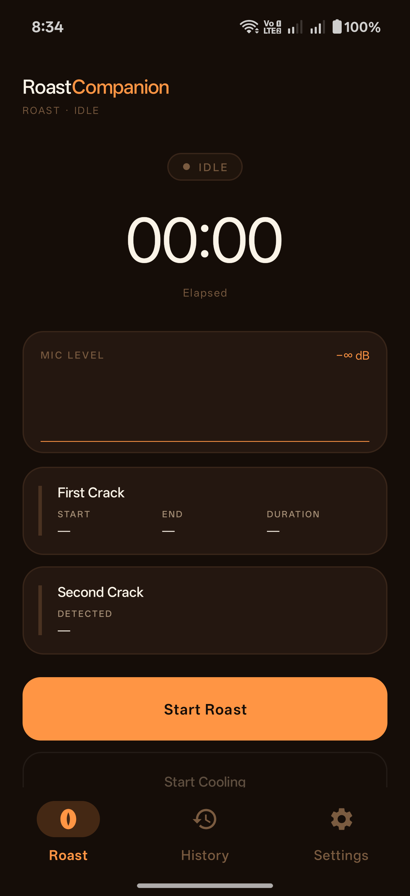
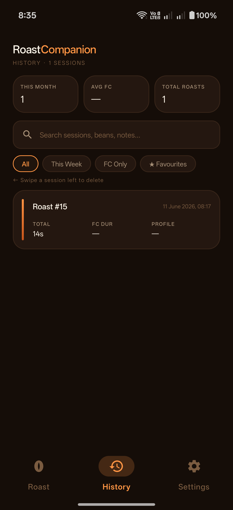
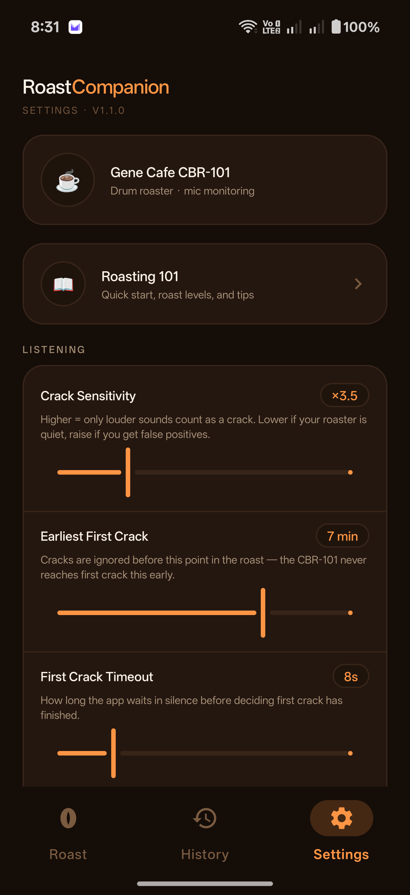
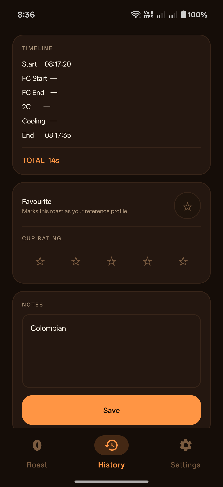

# RoastCompanion

A native Android app for monitoring coffee roasts on the **Gene Cafe CBR-101** drum roaster. It listens through the device microphone and uses real-time audio analysis — amplitude, spectral content, **and a small on-device machine-learning classifier** — to detect first crack and second crack, alarm you at second crack, and track the CBR-101's cooling carryover.

Built for personal use by an experienced home roaster — no onboarding, no fluff.

> **© 2026 Bjorn Technologies. All rights reserved.** Proprietary and
> confidential — see [LICENSE](LICENSE). Any public visibility of this
> repository is for demonstration only and grants no right to use, copy, or
> distribute the software, algorithms, or trained models.

---

## Screenshots

<table>
  <tr>
    <td align="center"><br/><sub>Roast</sub></td>
    <td align="center"><br/><sub>History</sub></td>
    <td align="center"><br/><sub>Settings</sub></td>
    <td align="center"><br/><sub>Session Detail</sub></td>
  </tr>
</table>

---

## Features

### Roast Monitoring
- **Start Roast** begins a session, starts the roast timer, and activates microphone monitoring via a foreground service
- Real-time **mic level meter** (scrolling chart) so you can see the audio environment is being captured
- Running **session timer** displayed prominently throughout, in elapsed roast-time
- **Live roast-level indicator** — a pill that shows where you'd land if you dropped now (City → City+ → Full City → Full City+ → Vienna → French) as development progresses
- Action buttons (Start / Pause / Stop / Reset) are pinned in a fixed footer, always reachable without scrolling

### First & Second Crack Detection
A crack is a 1–5 ms pop. Every 50 ms frame gets an **impulsiveness** score (how far its loudest millisecond stands above the rest); a frame above the bar counts as a pop. The detector watches the **pop rate** and fires when it climbs well above *this roast's own* recent baseline and stays there — so it adapts to phone placement and mic gain instead of relying on absolute loudness.

- **First crack:** pops in the last 20 s rise above 1.7× (and +20 over) the median of the preceding 2 min, for 5 s; never before *Earliest First Crack* − 1 min
- **First crack end:** the rate falls back near the pre-crack baseline for the *FC Quiet Period*
- **Second crack:** from 90 s after first crack, pops in the last 10 s rise above 1.3× (and +3 over) the post-FC baseline, for 3 s
- **Crack Sensitivity** (1–5) scales those margins; 3 is the tuned default
- Tapping **FC start** re-anchors first crack to now, and second-crack timing follows from there
- The roast cards **flood with colour** as progress bars: first crack fills across the FC→SC stretch, second crack fills toward your pull point, paced by your reference roast
- On second crack: a looping **alarm** + vibration + a heads-up notification with **Stop alarm** — raised by the background service, so it works with the screen off (caps at 2 min)

### Detection Accuracy & Training
- `training_data/scripts/harness.py` replays the detector over every by-ear-labelled roast. On 18 roasts at sensitivity 3: first crack 11/18 within −30..+60 s with none early; second crack after a manual FC tap 9/16 within ±30 s, none early or late
- **Record roasts for training** (Settings → Training, off by default) saves a WAV + a JSON of crack timestamps (measured on the audio clock) per session; more labelled roasts is the biggest lever for accuracy
- The detector exists twice — `audio/RollDetector.kt` and `training_data/scripts/rolldet.py` — and unit tests replay real roast traces to keep them identical

### Reference Roast
- Star a roast ★ as a favourite to make it the **reference** — its FC/SC times show as live targets on the Roast screen and set the pacing for the progress bars

### CBR-101 Carryover Cooling
- "Start cooling" (from the second-crack alert) opens a carryover timer — the CBR-101 keeps developing beans for ~45s after you pull, and this counts it down

### Roast Log
- Every session is saved to a local **Room database**
- Log screen lists sessions newest-first with search, filter, and swipe-to-delete (with undo)
- Session detail shows the full timeline in **elapsed roast-time** (Start → FC Start → FC End → 2C → Cooling → End), derived stats (development time, DTR), editable notes, a 1–5 cup rating, temperatures, and bean/weight metadata
- **Autocomplete dropdowns** for roast name, bean, and green weight — pulled from your own past roasts so you don't retype
- CSV export / import (RFC-4180, dedupes on start time) and Delete All History

### Settings
| Setting | Default | Description |
|---|---|---|
| Crack Sensitivity | 3 | 1–5: how readily first/second crack are called (raise if missed/late, lower if early) |
| Earliest First Crack | 9 min | Auto first crack can fire at most 1 min before this |
| FC Quiet Period | 25s | Sustained quiet after FC activity before FC is marked complete |
| Record roasts for training | Off | Save WAV + label JSON per roast for model training |
| Keep Screen Awake | On | Only while a roast is active |
| Alarm Sound / Vibration | On | Alert on crack events |

---

## Audio Detection Algorithm

The engine runs entirely on-device with no network dependency.

**Capture:** AudioRecord at 44100 Hz, 16-bit PCM mono, read in 50 ms windows (2205 samples) → 20 analysis frames/second.

**Impulsiveness:** the frame's 2nd difference (a high-pass that keeps clicks, drops fan rumble) is split into 50 one-millisecond blocks; score = ln(max block energy / median block energy). A pop is a frame scoring > 3.5.

**Rates & baselines:** pops are counted over a sliding 20 s (FC) and 10 s (SC) window, sampled once per second. Baselines are medians of those per-second rates over a recent span that ends a little before "now", so the rise being tested isn't part of its own baseline.

**State machine:**
```
IDLE → [Start] → MONITORING
MONITORING → [pop rate ≫ baseline for 5 s, after the earliest-FC floor] → FIRST_CRACK_ACTIVE
FIRST_CRACK_ACTIVE → [rate back near baseline for the quiet period] → FIRST_CRACK_COMPLETE
FIRST_CRACK_* → [10 s rate ≫ post-FC baseline for 3 s, ≥90 s after FC] → SECOND_CRACK_ACTIVE
SECOND_CRACK_ACTIVE → [Start cooling] → COOLING
```

The live level meter and the "×ratio / spec" diagnostics on the Roast screen come from the older amplitude + spectral gates, which no longer decide anything.

---

## Usage Tips

- **Phone placement:** the **exhaust side** of the CBR-101 gives the best read — the vent channels crack sound and sits away from the bulk fan roar. Keep the same placement every roast so recordings stay comparable.
- **Reference roast:** star a good roast ★ so the Roast screen shows live FC/SC targets and the progress bars pace correctly.
- **Recording for training:** turn on Settings → Training before a roast to capture a WAV + label JSON; the more roasts you record, the sharper detection gets — second crack especially, since it's the hardest to capture.
- **Second crack timing:** SC on the CBR-101 is quieter and snappier than FC. If you pull right as it starts, the detection has only the onset to work with — that's expected.

---

## Tech Stack

| Component | Library |
|---|---|
| Language | Kotlin |
| Min SDK / Target SDK | 26 (Android 8.0) / 34 (Android 14) |
| UI | Material Design 3, ViewBinding |
| Navigation | Navigation Component 2.7.7 + Safe Args |
| Audio | AudioRecord API + custom FFT |
| Database | Room 2.6.1 (KSP) |
| Settings | DataStore Preferences 1.1.1 |
| DI | Hilt 2.51.1 |
| Async | Coroutines + Flow |
| Charts | MPAndroidChart 3.1.0 |
| Training / evaluation | Python (numpy; TensorFlow + librosa for the experimental classifier) |

---

## Project Structure

```
app/src/main/
└── java/com/roastcompanion/
    ├── audio/
    │   ├── AudioAnalyzer.kt        # per-frame pipeline, phase state, flows
    │   ├── TransientDetector.kt    # RMS + rolling ambient (level meter, diagnostics)
    │   ├── SpectralGate.kt         # FFT, 2–9 kHz crack-band ratio
    │   ├── FeatureExtractor.kt     # impulsiveness + feature spec v2 (port of features.py)
    │   ├── RollDetector.kt         # pop-rate FC/SC detector (port of rolldet.py)
    │   ├── RoastPhase.kt           # State machine phases
    │   └── CrackEvent.kt           # Sealed class: FC started/ended, SC started
    ├── data/                       # Room (entity/DAO), RoastRepository, DataStore prefs
    ├── service/                    # RoastMonitorService — foreground service, owns AudioRecord + WAV recorder
    ├── di/                         # Hilt modules (DB, Audio)
    ├── ui/
    │   ├── roast/                  # Roast screen + ViewModel, carryover sheet
    │   ├── log/                    # Session list, detail, adapter
    │   ├── settings/               # Settings
    │   └── guide/                  # Roasting 101 reference
    └── util/                       # CrackAlarm, Notification, Permission, TimeFormatter

training_data/
├── scripts/                        # extract.py, harness.py, rolldet.py, features.py, labels.py, train_v2.py
├── raw/                            # recorded WAV + JSON pairs (gitignored)
├── features/                       # extracted per-roast features (gitignored)
└── model/                          # experimental classifier output (gitignored)
```

`AudioAnalyzer` is a Hilt singleton shared between the foreground service (which writes audio into it and optionally records a WAV) and the ViewModels (which collect its `StateFlow`/`SharedFlow` outputs) — no service binding required.

---

## Building

1. Clone and open in Android Studio
2. Let Gradle sync
3. Connect an Android device (API 26+) — emulators have no mic input
4. Run — mic permission is requested on first "Start Roast"

Releases are built by GitHub Actions on a `vX.Y.Z` tag (signed APK). See `RELEASING.md`.

> **Alarm sound:** uses the device's default alarm ringtone via `RingtoneManager` — no bundled audio. Ensure an alarm sound is set in system settings.

---

## Permissions

| Permission | When | Purpose |
|---|---|---|
| `RECORD_AUDIO` | First "Start Roast" | Microphone access for crack detection |
| `POST_NOTIFICATIONS` | First "Start Roast" (Android 13+) | Foreground service notification |
| `FOREGROUND_SERVICE_MICROPHONE` | Install | Mic use in foreground service |
| `VIBRATE` | Install | Vibration alerts |

---

## Limitations & Known Considerations

- Detection blends amplitude, spectral, and a small ML classifier trained on a modest number of real roasts. It is a monitoring aid, not a replacement for attention — always watch your beans.
- Second crack is the hardest event to detect well: it's quiet, and on this roaster you often pull right as it begins, so there's little SC audio to learn from. Detection of it will keep improving as more roasts are recorded.
- The classifier is only as good as its training data and assumes a consistent mic position (exhaust side recommended). Train and roast from the same placement.
- Carryover is a configurable timer, not a thermometric model.
- If the OS kills the app under memory pressure, in-progress session data is already persisted incrementally, so logged FC/SC timestamps survive.

---

## License

Proprietary. Copyright © 2026 Bjorn Technologies. All rights reserved. See
[LICENSE](LICENSE). No use, copying, modification, or distribution without
written permission.
